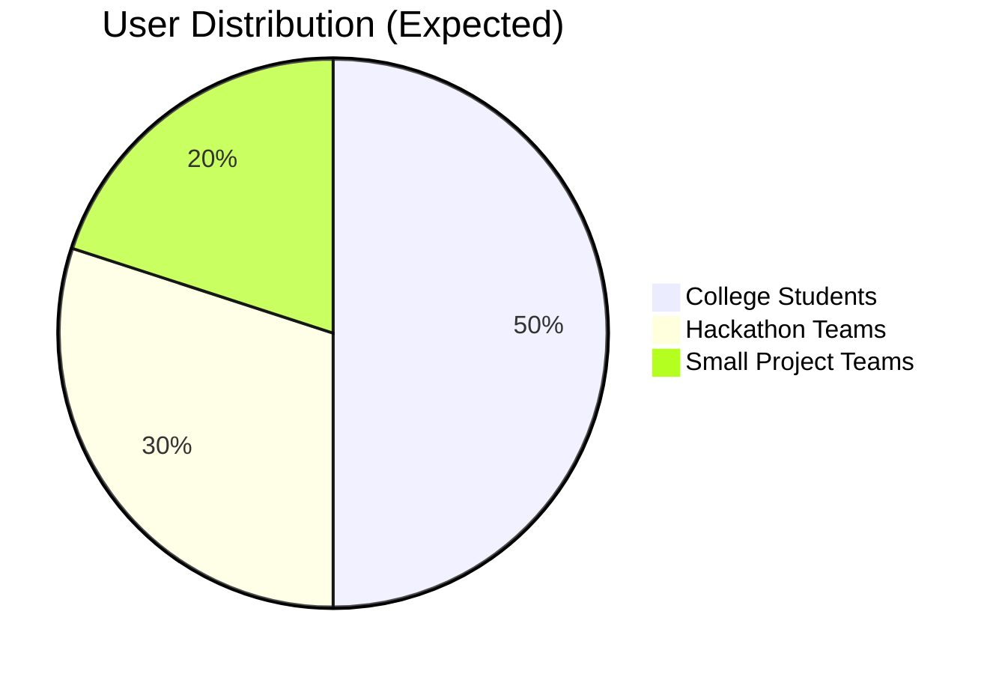
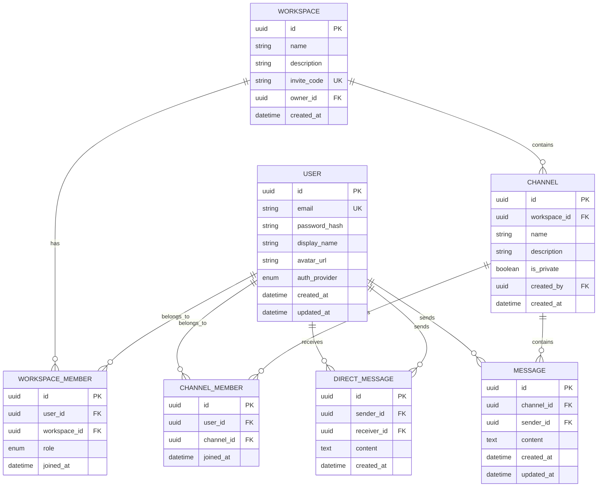

# CollabSpace - Product Requirements Document

## 1. Executive Summary

**CollabSpace** is a lightweight, open-source collaboration platform designed specifically for students, hackathon teams, and small project groups. It combines real-time messaging, 1-to-1 video calls with screen sharing, and an intuitive workspace structure—all built with free and open-source technologies.

### Vision Statement
*Empower students and small teams to collaborate seamlessly without the complexity, fragmentation, or cost of enterprise tools.*

---

## 2. Problem Statement

### Current Pain Points

Students and small teams currently face significant challenges with existing collaboration tools:

| Challenge | Description |
|-----------|-------------|
| **Fragmentation** | Teams use 4-5 different tools (WhatsApp, Discord, Google Meet, Slack) leading to context-switching fatigue |
| **Complexity** | Enterprise tools like Slack/Teams have steep learning curves and overwhelming feature sets |
| **Cost Barriers** | Serious usage often requires paid plans (Zoom limits, Slack message history, etc.) |
| **Poor Fit** | Existing tools aren't designed for learning-focused, time-bound collaboration (hackathons, semester projects) |

### Market Gap

There is no free, simple, all-in-one solution that combines:
- Real-time messaging with workspace organization
- Video calling with screen sharing
- Zero-cost deployment and hosting
- Open-source, forkable codebase

---

## 3. Solution Overview

### Core Value Proposition

CollabSpace provides **one unified platform** that combines:

```
┌─────────────────────────────────────────────────────────────┐
│                       CollabSpace                           │
├─────────────────┬─────────────────┬─────────────────────────┤
│   💬 Messaging  │   📹 Video      │   🏢 Workspaces         │
│   - Real-time   │   - 1-to-1 calls│   - Organized channels  │
│   - Channels    │   - Screen share│   - Public & private    │
│   - DMs         │   - Low latency │   - Easy onboarding     │
└─────────────────┴─────────────────┴─────────────────────────┘
```

### Key Differentiators

1. **Zero-Cost**: 100% free to build, deploy, and fork
2. **Lightning Fast**: Sub-200ms message delivery, <5s video connection
3. **Student-Focused**: Designed for 2-10 person teams with project-based workflows
4. **Open Source**: Fully customizable and community-driven

---

## 4. Goals & Success Metrics

### 4.1 Primary Goals

| Priority | Goal | Rationale |
|----------|------|-----------|
| P0 | Enable real-time collaboration with near-zero latency | Core user experience requirement |
| P0 | Provide smooth video calls without paid infrastructure | Eliminates major cost barrier |
| P1 | Allow users to onboard and collaborate within <2 minutes | Reduces friction for hackathon teams |
| P1 | Remain 100% free to build, deploy, and fork | Core product philosophy |

### 4.2 Success Metrics (MVP)

| Metric | Target | Measurement Method |
|--------|--------|-------------------|
| Message delivery latency | < 200ms | Server-side timestamp analysis |
| Video call connection time | < 5 seconds | Client-side timer from click to media |
| First-time onboarding | < 2 minutes | Analytics: signup to first message |
| App crash rate | < 1% | Error monitoring (Sentry) |
| Lighthouse performance | ≥ 85 | Automated CI checks |
| User retention (7-day) | ≥ 40% | Analytics tracking |

---

## 5. Target Users

### 5.1 Primary User Segments



### 5.2 User Personas

#### Persona 1: Student Developer (Primary)
- **Name**: Alex Chen
- **Age**: 20 | Computer Science major
- **Goals**: Quick collaboration, code discussions, screen sharing for debugging
- **Pain Points**: Tired of switching between Discord for chat and Google Meet for calls
- **Behavior**: Uses mobile and desktop, prefers keyboard shortcuts, values speed

#### Persona 2: Team Lead / Organizer
- **Name**: Priya Sharma
- **Age**: 22 | Project manager for university projects
- **Goals**: Organize team communication, track who's online, manage channels
- **Pain Points**: Difficulty keeping team organized across multiple platforms
- **Behavior**: Creates structure, manages permissions, schedules check-ins

#### Persona 3: Mentor / Advisor
- **Name**: Dr. Marcus Williams
- **Age**: 35 | Faculty advisor
- **Goals**: Quick 1-to-1 calls with mentees, screen sharing for code reviews
- **Pain Points**: Enterprise tools feel overkill for occasional mentoring
- **Behavior**: Occasional usage, values simplicity, prefers video for feedback

---

## 6. Scope Definition

### 6.1 In Scope (MVP) ✅

| Category | Features |
|----------|----------|
| **Authentication** | Email signup/login, Google OAuth, JWT-based sessions |
| **Workspaces** | Create, join (via invite link), admin management |
| **Channels** | Public and private channels, create/join/leave |
| **Messaging** | Real-time messaging, persistence, typing indicators, pagination |
| **Presence** | Online/offline status, real-time updates |
| **Video Calls** | 1-to-1 peer-to-peer WebRTC calls with mute/video toggle |
| **Screen Sharing** | Share screen during video calls |
| **UI/UX** | Responsive design (mobile + desktop) |

### 6.2 Out of Scope (MVP) ❌

| Feature | Reason for Exclusion | Potential Future Phase |
|---------|---------------------|----------------------|
| Group video calls (>2) | WebRTC complexity, server costs | Phase 2 |
| Call recording | Storage costs, privacy concerns | Phase 3 |
| Mobile native apps | Resource constraints | Phase 3 |
| AI features | Scope creep, API costs | Future |
| Monetization | MVP focus on adoption | Future |
| Enterprise security (SSO, audit) | Not target audience | N/A |
| File sharing | Complexity, storage | Phase 2 |
| Message reactions | Nice-to-have | Phase 2 |
| Threads | Complexity | Phase 2 |

---

## 7. Functional Requirements

### 7.1 Authentication System

> **FR-AUTH-001**: Users MUST authenticate before accessing any workspace features

| Requirement ID | Description | Priority |
|----------------|-------------|----------|
| FR-AUTH-001 | Email/password registration with validation | P0 |
| FR-AUTH-002 | Google OAuth 2.0 integration | P0 |
| FR-AUTH-003 | JWT-based authentication (access + refresh tokens) | P0 |
| FR-AUTH-004 | Password hashing using bcrypt (min 10 rounds) | P0 |
| FR-AUTH-005 | Password reset via email | P1 |
| FR-AUTH-006 | Session management with token refresh | P0 |

### 7.2 Workspace Management

| Requirement ID | Description | Priority |
|----------------|-------------|----------|
| FR-WS-001 | Users can create new workspaces with name and description | P0 |
| FR-WS-002 | Workspace creator becomes admin automatically | P0 |
| FR-WS-003 | Generate unique invite links for workspace joining | P0 |
| FR-WS-004 | Admins can regenerate/invalidate invite links | P1 |
| FR-WS-005 | Users can belong to multiple workspaces | P0 |
| FR-WS-006 | Workspace settings page for admins | P1 |

### 7.3 Channel Management

| Requirement ID | Description | Priority |
|----------------|-------------|----------|
| FR-CH-001 | Create public channels (visible to all workspace members) | P0 |
| FR-CH-002 | Create private channels (invite-only) | P0 |
| FR-CH-003 | Users can join/leave public channels freely | P0 |
| FR-CH-004 | Channel creators can invite members to private channels | P0 |
| FR-CH-005 | Default #general channel created with each workspace | P1 |
| FR-CH-006 | Channel descriptions and settings | P2 |

### 7.4 Messaging System

| Requirement ID | Description | Priority |
|----------------|-------------|----------|
| FR-MSG-001 | Send text messages in channels | P0 |
| FR-MSG-002 | Real-time message delivery via WebSocket | P0 |
| FR-MSG-003 | Message persistence in database | P0 |
| FR-MSG-004 | Typing indicators (shows who is typing) | P0 |
| FR-MSG-005 | Message pagination (load older messages) | P0 |
| FR-MSG-006 | Direct messages (1-to-1 private messaging) | P0 |
| FR-MSG-007 | Message timestamps with relative time display | P0 |
| FR-MSG-008 | Unread message indicators | P1 |
| FR-MSG-009 | Message editing (within 5 minutes) | P2 |
| FR-MSG-010 | Message deletion | P2 |

### 7.5 Presence System

| Requirement ID | Description | Priority |
|----------------|-------------|----------|
| FR-PR-001 | Display online/offline status for all workspace members | P0 |
| FR-PR-002 | Real-time presence updates via WebSocket | P0 |
| FR-PR-003 | Automatic offline status on disconnect (with 30s grace period) | P0 |
| FR-PR-004 | "Away" status after 5 minutes of inactivity | P1 |
| FR-PR-005 | Custom status messages | P2 |

### 7.6 Video Calling

| Requirement ID | Description | Priority |
|----------------|-------------|----------|
| FR-VC-001 | Initiate 1-to-1 video call with any workspace member | P0 |
| FR-VC-002 | WebRTC peer-to-peer connection for media | P0 |
| FR-VC-003 | Backend signaling server for WebRTC handshake | P0 |
| FR-VC-004 | Mute/unmute audio control | P0 |
| FR-VC-005 | Enable/disable video control | P0 |
| FR-VC-006 | End call functionality | P0 |
| FR-VC-007 | Incoming call notification with accept/reject | P0 |
| FR-VC-008 | Call disconnects if either peer leaves | P0 |
| FR-VC-009 | Connection quality indicator | P2 |

### 7.7 Screen Sharing

| Requirement ID | Description | Priority |
|----------------|-------------|----------|
| FR-SS-001 | Share entire screen during video call | P0 |
| FR-SS-002 | Share specific application window | P1 |
| FR-SS-003 | Stop sharing returns to video feed | P0 |
| FR-SS-004 | Viewer sees screen share in main video area | P0 |

---

## 8. Non-Functional Requirements

### 8.1 Performance

| Requirement ID | Description | Target | Priority |
|----------------|-------------|--------|----------|
| NFR-PERF-001 | Message delivery latency | < 200ms | P0 |
| NFR-PERF-002 | Video call latency | < 300ms (ideal network) | P0 |
| NFR-PERF-003 | Page load time (LCP) | < 2.5s | P0 |
| NFR-PERF-004 | WebSocket connection stability | > 1 hour without reconnect | P0 |
| NFR-PERF-005 | Time to Interactive (TTI) | < 3s | P1 |

### 8.2 Scalability

| Requirement ID | Description | Priority |
|----------------|-------------|----------|
| NFR-SCALE-001 | Horizontally scalable backend architecture | P1 |
| NFR-SCALE-002 | Stateless API layer (JWT, no server sessions) | P0 |
| NFR-SCALE-003 | Support 100 concurrent users per workspace | P1 |
| NFR-SCALE-004 | Database connection pooling | P1 |

### 8.3 Security

| Requirement ID | Description | Priority |
|----------------|-------------|----------|
| NFR-SEC-001 | HTTPS only (TLS 1.2+) | P0 |
| NFR-SEC-002 | JWT validation on all protected routes | P0 |
| NFR-SEC-003 | Input sanitization (XSS prevention) | P0 |
| NFR-SEC-004 | SQL injection prevention (parameterized queries) | P0 |
| NFR-SEC-005 | Rate limiting on authentication endpoints | P0 |
| NFR-SEC-006 | CORS configuration for allowed origins | P0 |
| NFR-SEC-007 | Secure WebSocket connections (WSS) | P0 |

### 8.4 Reliability

| Requirement ID | Description | Priority |
|----------------|-------------|----------|
| NFR-REL-001 | Graceful WebSocket reconnection (exponential backoff) | P0 |
| NFR-REL-002 | Message delivery confirmation | P1 |
| NFR-REL-003 | Retry logic for WebRTC signaling | P0 |
| NFR-REL-004 | Error boundaries in UI (graceful degradation) | P1 |
| NFR-REL-005 | Health check endpoints for monitoring | P1 |

### 8.5 Accessibility

| Requirement ID | Description | Priority |
|----------------|-------------|----------|
| NFR-ACC-001 | WCAG 2.1 AA compliance for core flows | P1 |
| NFR-ACC-002 | Keyboard navigation support | P1 |
| NFR-ACC-003 | Screen reader compatibility | P2 |
| NFR-ACC-004 | Sufficient color contrast ratios | P1 |

---

## 9. Technical Architecture

### 9.1 High-Level Architecture

```
┌─────────────────────────────────────────────────────────────────┐
│                         CLIENT LAYER                            │
│                   Next.js + TypeScript + Tailwind               │
└─────────────────────────────────────────────────────────────────┘
                              │
                              │ HTTPS / WSS
                              ▼
┌─────────────────────────────────────────────────────────────────┐
│                        API GATEWAY                              │
│                     (Nginx / Vercel Edge)                       │
└─────────────────────────────────────────────────────────────────┘
                              │
              ┌───────────────┴───────────────┐
              │                               │
              ▼                               ▼
┌─────────────────────────┐     ┌─────────────────────────┐
│     REST API SERVER     │     │   WEBSOCKET SERVER      │
│   Node.js + Express     │     │   Node.js + Socket.IO   │
│                         │     │                         │
│  • Auth endpoints       │     │  • Real-time messaging  │
│  • CRUD operations      │     │  • Presence updates     │
│  • Business logic       │     │  • WebRTC signaling     │
│                         │     │  • Typing indicators    │
└─────────────────────────┘     └─────────────────────────┘
              │                               │
              └───────────────┬───────────────┘
                              │
                              ▼
┌─────────────────────────────────────────────────────────────────┐
│                        DATA LAYER                               │
│  ┌─────────────────┐              ┌─────────────────────┐       │
│  │   PostgreSQL    │              │       Redis         │       │
│  │   (via Prisma)  │              │    (Optional)       │       │
│  │                 │              │                     │       │
│  │  • Users        │              │  • Session cache    │       │
│  │  • Workspaces   │              │  • Presence data    │       │
│  │  • Channels     │              │  • Rate limiting    │       │
│  │  • Messages     │              │  • Typing states    │       │
│  │  • Memberships  │              │                     │       │
│  └─────────────────┘              └─────────────────────┘       │
└─────────────────────────────────────────────────────────────────┘
```

### 9.2 Video Call Architecture (WebRTC)

```
┌──────────────┐                                    ┌──────────────┐
│   User A     │                                    │    User B    │
│   Browser    │                                    │   Browser    │
└──────┬───────┘                                    └──────┬───────┘
       │                                                   │
       │  1. Call initiation request                       │
       │ ─────────────────────────────────────────────────>│
       │                                                   │
       │             ┌─────────────────────┐               │
       │             │  Signaling Server   │               │
       │             │   (Socket.IO)       │               │
       │             └─────────┬───────────┘               │
       │                       │                           │
       │  2. Exchange SDP offers/answers                   │
       │<──────────────────────┼──────────────────────────>│
       │                       │                           │
       │  3. Exchange ICE candidates                       │
       │<──────────────────────┼──────────────────────────>│
       │                       │                           │
       │  4. Peer-to-peer connection established           │
       │<═════════════════════════════════════════════════>│
       │                                                   │
       │  5. Media streams (audio/video/screen)            │
       │<═════════════════════════════════════════════════>│
       │        (Direct peer connection)                   │
```

### 9.3 Technology Stack

| Layer | Technology | Rationale |
|-------|------------|-----------|
| **Frontend** | Next.js 14 + TypeScript | SSR, file-based routing, React ecosystem |
| **Styling** | Tailwind CSS | Rapid development, consistent design |
| **State Management** | Zustand / React Context | Lightweight, sufficient for MVP |
| **Backend** | Node.js + Express | JavaScript ecosystem, async I/O |
| **WebSocket** | Socket.IO | Reliable, auto-reconnection, rooms |
| **Database** | PostgreSQL | Reliable, relational, free hosting |
| **ORM** | Prisma | Type-safe, migrations, excellent DX |
| **Cache** | Redis (optional) | Presence, rate limiting, sessions |
| **Video** | WebRTC native APIs | P2P, no server costs, built-in |
| **Auth** | JWT + bcrypt | Stateless, secure, standard |

---

## 10. Data Model

### 10.1 Entity Relationship Diagram



### 10.2 Data Retention Policies

| Data Type | Retention Period | Notes |
|-----------|------------------|-------|
| User accounts | Indefinite | Until user requests deletion |
| Messages | Indefinite (MVP) | Consider archival strategy post-MVP |
| Workspaces | Indefinite | Until admin deletes |
| Video streams | Not recorded | Real-time only |
| Presence data | Ephemeral | Redis TTL or memory |

---

## 11. User Interface Requirements

### 11.1 Key Screens

| Screen | Purpose | Priority |
|--------|---------|----------|
| Landing Page | Product info, signup/login CTAs | P0 |
| Auth Pages | Login, Register, Password Reset | P0 |
| Workspace Dashboard | List of workspaces, create/join | P0 |
| Channel View | Message list, input, member list | P0 |
| Direct Message View | 1-to-1 conversation | P0 |
| Video Call Modal | Call controls, video feeds | P0 |
| Settings Page | Profile, notifications, account | P1 |

### 11.2 Responsive Breakpoints

| Breakpoint | Width | Layout |
|------------|-------|--------|
| Mobile | < 640px | Single column, collapsible sidebar |
| Tablet | 640px - 1024px | Two-column, compact sidebar |
| Desktop | > 1024px | Three-column (sidebar + content + member list) |

---

## 12. Release Plan

### Phase 1: MVP (4 Weeks)

| Week | Focus | Deliverables |
|------|-------|-------------|
| Week 1 | Foundation | Auth system, database schema, project setup |
| Week 2 | Core Features | Workspaces, channels, real-time messaging |
| Week 3 | Communication | Video calls, screen sharing, presence |
| Week 4 | Polish & Deploy | Bug fixes, responsive UI, deployment |

### Phase 2: Enhancements (4 Weeks)

| Feature | Description |
|---------|-------------|
| Group calls | Support up to 4 participants |
| File sharing | Upload and share files in channels |
| Message reactions | Emoji reactions on messages |
| Threads | Reply threads within channels |

### Phase 3: Scale (Future)

- Mobile native apps (React Native)
- Advanced search
- Integrations (GitHub, Jira)
- Admin analytics dashboard

---

## 13. Risks & Mitigation

| Risk | Probability | Impact | Mitigation Strategy |
|------|-------------|--------|---------------------|
| WebRTC browser compatibility | Medium | High | Use adapter.js polyfill, test across browsers |
| Network issues affecting calls | High | Medium | Implement TURN server fallback, connection quality indicator |
| Free-tier hosting limits | Medium | Medium | Optimize for efficiency, consider Railway/Render credits |
| Scope creep | High | High | Strict MVP definition, defer to Phase 2 |
| Security vulnerabilities | Low | High | Security audit, dependency scanning, rate limiting |

---

## 14. Acceptance Criteria (MVP)

### Must Have (MVP Release Gate)

- [ ] User can register and login (email + Google)
- [ ] User can create and join workspaces via invite link
- [ ] User can create public and private channels
- [ ] User can send and receive real-time messages
- [ ] User can see online/offline status of team members
- [ ] User can initiate and receive 1-to-1 video calls
- [ ] User can share screen during video call
- [ ] App works on mobile and desktop browsers
- [ ] App successfully deployed to free-tier hosting
- [ ] Codebase is documented and open-source ready

### Quality Gates

- [ ] All P0 functional requirements implemented
- [ ] Lighthouse score ≥ 85
- [ ] No critical security vulnerabilities
- [ ] All core user flows tested (manual + automated)

---

## 15. Appendix

### A. Technology Decision Records

| Decision | Options Considered | Chosen | Rationale |
|----------|-------------------|--------|-----------|
| Frontend Framework | React, Vue, Svelte, Next.js | Next.js | SSR, ecosystem, deployment ease |
| Backend Runtime | Node.js, Deno, Python | Node.js | Ecosystem, Socket.IO support |
| Database | MongoDB, PostgreSQL, SQLite | PostgreSQL | Relational integrity, Prisma support |
| WebSocket Library | ws, Socket.IO, uWebSockets | Socket.IO | Ease of use, rooms, reconnection |
| CSS Framework | Tailwind, Bootstrap, CSS-in-JS | Tailwind | Utility-first, performance |

### B. Glossary

| Term | Definition |
|------|------------|
| Workspace | A container for a team with channels and members |
| Channel | A topic-based chat room within a workspace |
| DM | Direct Message - private 1-to-1 conversation |
| Presence | Real-time indication of user's online status |
| WebRTC | Web Real-Time Communication - P2P media protocol |
| Signaling | Process of exchanging connection metadata before WebRTC |

### C. References

- [WebRTC API Documentation](https://developer.mozilla.org/en-US/docs/Web/API/WebRTC_API)
- [Socket.IO Documentation](https://socket.io/docs/v4/)
- [Prisma Documentation](https://www.prisma.io/docs/)
- [Next.js Documentation](https://nextjs.org/docs)
