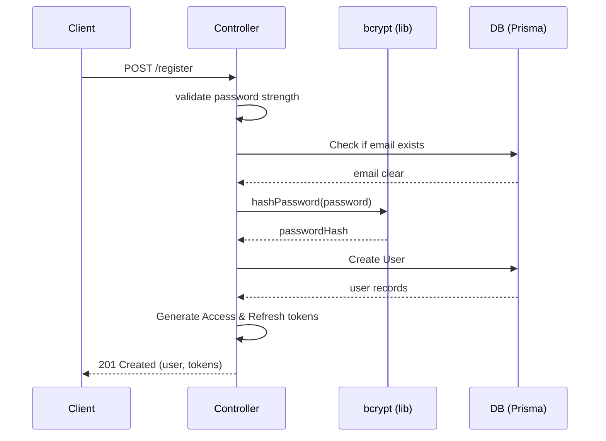
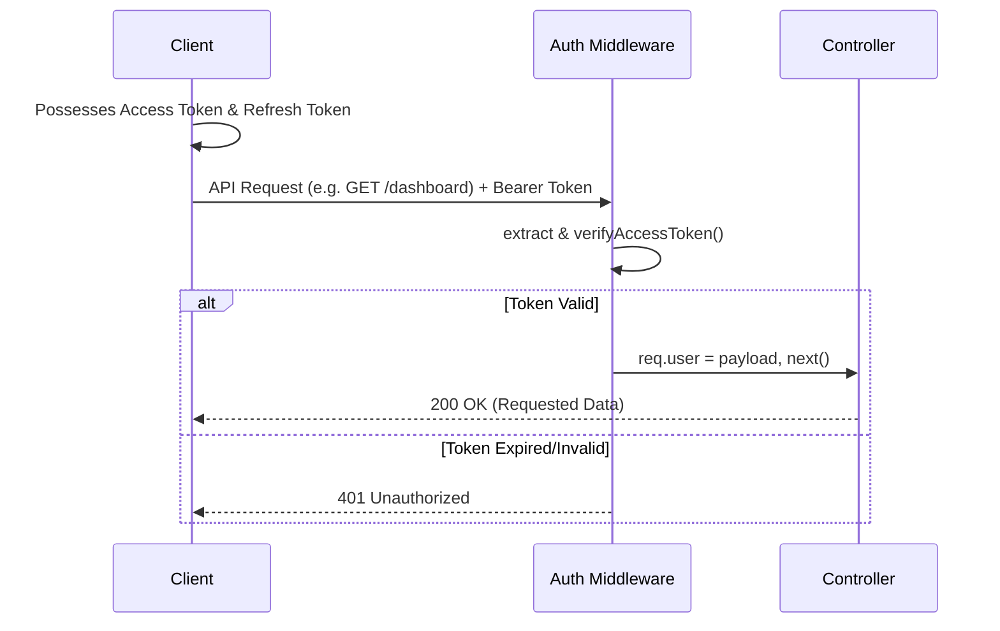
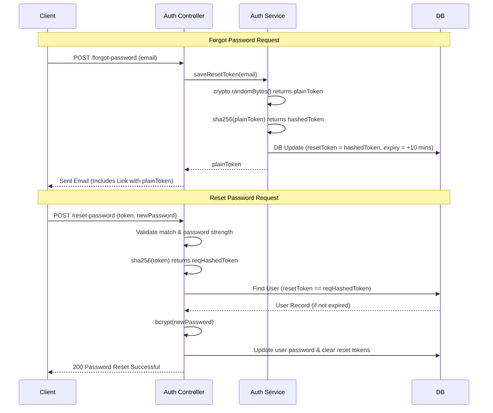

# 🚀 Authentication System Revision Guide (Hinglish)

Bhai, agar interview me apne backend ka authentication system explain karna ho, toh yeh document tere liye perfect revision guide hai. Poora system modular or scalable banaya gaya hai. Humne **Separation of Concerns** ko strictly follow kiya hai taaki code clean rahe.

---

## 🏗️ Folder Structure & Basic Concepts (Interview me bolne ke liye)

Interview me poocha jayega ki "Tumne apna code structured kaise kiya?". Toh ye analogy dena:

*   **Route (`src/routes/`) = Road:** Yeh sirf rasta dikhata hai. User ki request aati hai toh usko sahi Controller ke paas point karta hai. Yaha pe DB calls ya token logic NAHI likhte.
*   **Controller (`src/controllers/`) = Traffic Police:** Yeh `req` aur `res` handle karta hai. Request ki body se data nikalna, validations check karna, aur phir DB se data leke user ko response `res` wapas dena iska kaam hai.
*   **Service (`src/services/`) = Engine:** Yaha pe complex business logic aur heavy DB operations hote hain. Dhyan rahe, service file ko HTTP (`req`/`res`) ke baare me kuch nahi pata hota. Yeh bas function return karta hai.
*   **Lib (`src/lib/`) = Tools:** Yeh helper utilities hain. Jaise password hash karna (`bcrypt`), JWT token banana, aur Prisma ka DB instance. Isko multiple jagah reuse kiya jaa sakta hai.
*   **Middleware (`src/middlewares/`) = Security Guard:** Controller tak baat pahunchne se pehle ye check karega "Bhai tu entry ke kabil hai ya nahi?". Ex: `auth.js` (token validation), `rateLimiter.js` (brute-force se bachane).

---

## 📂 Kaunsi File Kya Karti Hai? (File-by-File Breakdown)

### 1. `routes/auth.js`
*   **Kya karta hai?** Sirf endpoints define karta hai: `/register`, `/login`, `/forgot-password`, `/reset-password`.
*   **Important:** Yaha middleware lagaya hai. Jaise `/login` aur `/forgot-password` pe `authRateLimit` lagaya hai taaki koi bot brute-force attack na kar de.

### 2. `controllers/auth.controller.js`
Yeh saari main HTTP requests aake rukti hain. 
*   **Register:** User ka data (email, password) liya -> `validatePassword()` se strength check ki -> Email exist toh nahi karti check kiya -> Password hash kiya -> Prisma se user create kiya -> Tokens (Access & Refresh) banake response me de diya.
*   **Login:** Email se user dhoondha -> Entered password ko DB ke hashed password se compare kiya (`verifyPassword`) -> Sahi hua toh naya JWT token banake return kardiya.
*   **Forgot Password:** User se email li -> `saveResetToken` service ko call kiya -> Usne token banake DB me us email k against update kiya aur hamein reset link bhej diya.
*   **Reset Password:** User ne Token, New Password bheja. Humne token ko pehle sha256 me wapas hash kiya (kyunki DB me hashed stored hai) -> DB me dhoondha ki expired to nhi -> Phir naya password hash karke save kiya aur reset token clear kar diya null karke.

### 3. `services/auth.service.js`
*   **Kya karta hai?** `saveResetToken()` isi me likha hai. Yeh string format me ek random hex token generate karta hai (`crypto.randomBytes`), phir usko security ke liye `sha256` hash me convert karke `user` table me `resetToken` update kar deta hai. Database me hamesha hashed token rakhte hain for security, aur user ko normal token dete hain URL me. Expiry time 10 minutes set karte hai.

### 4. `lib/auth.js`
*   **Tools:** Yeh file pure cryptography ka adda hai.
    *   `bcrypt` use karke: `hashPassword()` and `verifyPassword()`. Yaha cost factor 12 rakha gya hai.
    *   `jsonwebtoken` use karke: `generateAccessToken` (15m expiry) aur `generateRefreshToken` (7d expiry).
    *   Uske verification methods bhi yahin pr hain.

### 5. `middlewares/auth.js`
*   **Security Check:** `authenticate` function. Agar kisi route ko protect karna hai (jaise `/profile`), toh isko request ke beech me lagate hain.
*   Yeh Header se `Bearer <token>` nikalta hai -> Usko verify karta hai -> Agar sahi hai toh payload data nikal kar `req.user` me daal deta hai, `next()` call kr deta hai. Galt hai to `401 Unauthorized`.

---

## 🧠 Core Flows to Remember for Interview

👉 **Registration Flow:**
Client `post(/register)` -> Controller validations check karega -> `bcrypt` se password salt/hash hoga -> DB write hoga -> Payloads se `JWT` access aur refresh tokens generate honge -> Returns `201 Created`.

👉 **JWT Authentication Flow:**
Login pe 2 token milte hain: Access (15m) aur Refresh (7d). Har protected API call m Authorization header jayega. Middleware `auth.js` token extract karke verify karega. Agar token expire ho gya, toh frontend Refresh token ka use karke naya access token mangwaega.

👉 **Secure Forgot/Reset Password Flow (V.IMP):**
1. User ne `/forgot-password` hit kiya.
2. `crypto.randomBytes` se token bana. Hum plain token user ko email karenge (ab ke liye console me hai).
3. Usi token ka hum firse **SHA-256 hash** banayenge (Hashed version DB me expiry (10 min) ke sath store hoga).
4. User password reset karne `/reset-password` hit karega aur body me token lake aayega.
5. Us plain token ka dobara `sha-256` banayenge aur usko DB k stored `resetToken` column se compare karenge. Match kiya and expire nhi hua, toh password change allowed.

### 💡 Pro Tip (Interview ke liye)
"Humne password reset token ko DB me plain text me kyu nahi rakha?"
*Answer:* Kyunki agar DB compromise hua (leak hua), toh hacker un tokens ka misuse karke accounts takeover na kar sake. Isiliye waha v `sha-256` hashed form me save kiya gaya hai!
